# ASP.NET Core 2.0 with Rider 2018.2 and Visual Studio 2017

This document compares a developer's experience with an ASP.NET Core 2.0 application in two development environments: JetBrains Rider and Microsoft Visual Studio. For the purposes of providing an all-around, detailed comparison, the document walks through the various coding demos available in Scott Allen's [ASP.NET Core Fundamentals](https://app.pluralsight.com/library/courses/aspdotnet-core-fundamentals/table-of-contents) course (as of November 9, 2017) on Pluralsight.

The steps outlined were taken in Visual Studio 2017 15.7.4 (RTM) and various Rider 2018.2 pre-release builds.

<h2>Creating a new ASP.NET Core Web Application with C# (Empty template)</h2>

<h3>Observations: Visual Studio :green_heart:</h3>
<ol>
    <li><em>Solution Explorer</em>:
        <ol>
            <li>Initially expanded to file level (good).</li>
            <li>Text editor area contains ASP.NET Core specific overview page with documentation links; <em>Connected
                Services</em> and <em>Publish</em> panes are available for navigation: 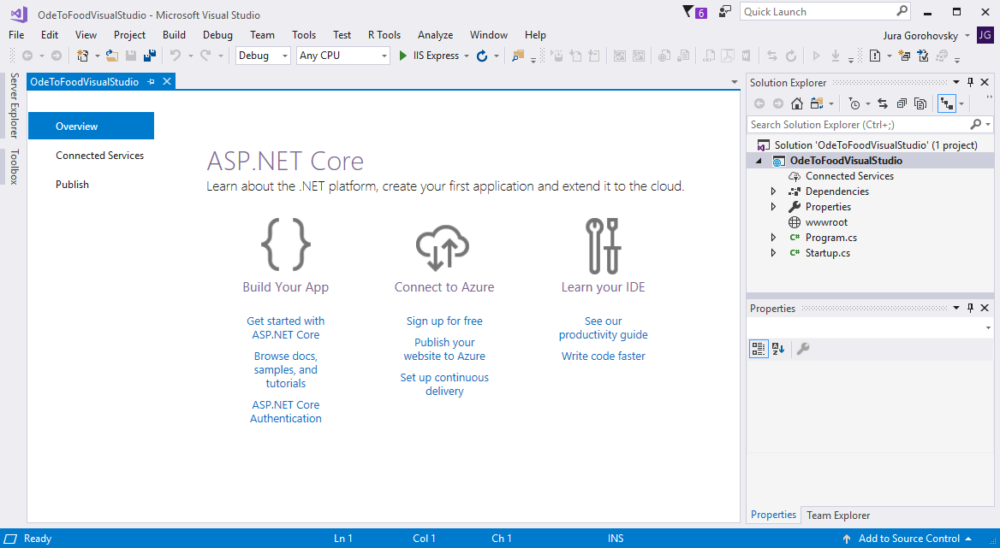
            </li>
        </ol>
    </li>
    <li>Multimonitor support: all UI related to creating a project is shown on a single display.</li>
</ol>

<h3>Observations: Rider :yellow_heart:</h3>
<ol>
    <li>In <em>New Solution</em> wizard, I can't select a directory using the updated <em>Open File</em> dialog; I have to
        enter the path to parent directory manually in the <em>Solution directory</em> text box, and no recent directories
        are available: 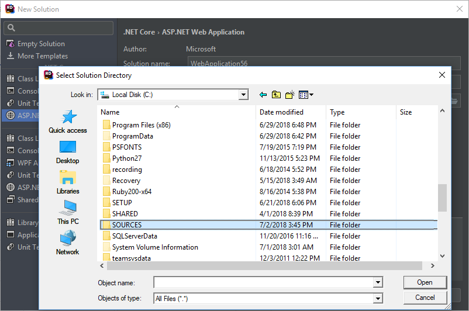
    </li>
    <li>Multimonitor support: Rider opened on display 1, <em>New Solution</em> wizard opened on display 2, then <em>Select
        Solution Directory</em> (<em>Open File</em>) opened on display 1 again.
    </li>
    <li>Initial IDE layout:
        <ol>
            <li><em>Solution Explorer</em>'s solution node is collapsed (suboptimal);</li>
            <li><em>Scratches and Consoles</em> node is visible (suboptimal, doesn't relate to the created project);
            </li>
            <li>Text editor area is empty, contains generic keymap hints: 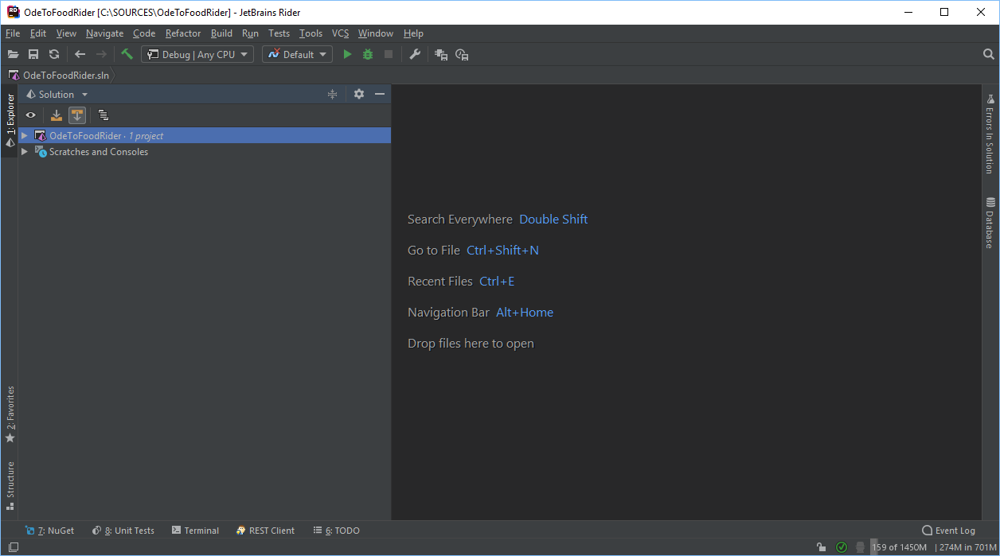
            </li>
        </ol>
    </li>
</ol>

<h2>Initial run of the application that we've just created</h2>

<h3>Observations: Visual Studio :green_heart:</h3>

All good. Built, ran using the default <em>IIS Express</em> launch profile. <em>Output</em> window shows output from
    ASP.NET Core Web Server, server says listening on port 17570, then requests going through a different
    port (54448) set in generated <em>applicationhost.config</em>, default browser (Chrome) automatically
    opens with the correct URL.

Links from the <em>Output</em> window can be <kbd>Ctrl</kbd>+clicked, which is a tiny bit worse than what
    Rider does.

Stopping is not clear: can't <kbd>Ctrl+C</kbd> in the <em>Output</em> window, and no <em>Stop</em> command is
    available in the <em>Debug</em> menu. The application can be either rerun from Visual Studio, or stopped
    using the separate IIS Express UI: 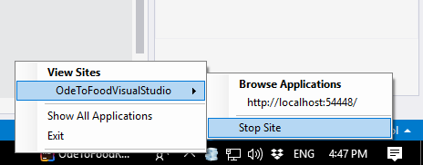

<h3>Observations: Rider :green_heart:</h3>

Accepted <em>Default</em> run configuration settings, built, ran.

<em>Run</em> tool window says listening on port 5000, further requests going through the same port.

Browser not automatically opened - however, clicking the link from the <em>Run</em> window works to open
    in default browser.

Stopping is clear: works with <kbd>Ctrl+C</kbd> in the <em>Run</em> tool window, as well as with the <em>Stop
    Default</em> command.

<h3>Notes, commits</h3>

I assume that the differences in start/stop experience are due to Visual Studio <a
        href="https://docs.microsoft.com/en-us/aspnet/core/fundamentals/servers/aspnet-core-module?view=aspnetcore-2.1">using
    IIS Express as a proxy</a> to Kestrel and Rider using Kestrel
    directly.

<h2>Opening and editing a project file</h2>

<h3>Observations: Visual Studio :green_heart:</h3>

A project file can be opened in the text editor via right-click &gt; <em>Edit project file</em>.

<em>Quick Info</em> tooltip is available on hover for valid <em>.csproj</em> elements: 
    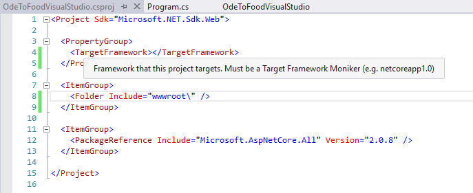

<h3>Observations: Rider :green_heart:</h3>

A project file can be opened in the text editor via <kbd>F4</kbd> or via right-click &gt; <em>Edit &gt; Edit
    ....csproj</em>.

No <em>Quick Info</em> is available on elements.

<h2>Creating a configuration file (appsettings.json)</h2>

<h3>Observations: Visual Studio  :green_heart:</h3>

Right-click a project node &gt; <em>Add &gt; New Item </em>(or <kbd>Ctrl+Shift+A</kbd>)<em> &gt; ASP.NET Core
    &gt; ASP.NET Core Configuration File</em> (renamed to <em>App Settings File</em> in later VS
    versions). This provides a predefined name (<em>appsettings.json</em>), and the default file template contains a
    <code>ConnectionStrings: DefaultConnection</code> setting: 
    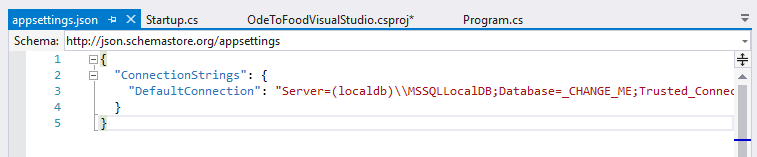

<h3>Observations: Rider :yellow_heart:</h3>

Right-click a project node &gt; <em>Add &gt; JSON file</em>. Just a generic JSON file template provided by
    WebStorm. No predefined name, empty content.

<h2>Modifying Startup.cs to use a value from appsettings.json</h2>

<h3>Observations: Visual Studio :green_heart:</h3>

Good editing experience in JSON and C#. Complete Statement doesn't work in JSON though, and importing a
    reference for <code>IConfiguration</code> is less obvious/comfortable than in Rider.

<h3>Observations: Rider :green_heart:</h3>

Good editing experience in JSON and C#. Import popup more useful than explicitly calling <em>Ctrl+.</em>
    in Visual Studio for importing a reference for <code>IConfiguration</code>.

<h2>Creating and injecting a custom Greeter service instead of hardcoded settings value</h2>

<h3>Observations: Visual Studio :green_heart:</h3>

All fine. Visual Studio handles Create from Usage and implementing interface members in a derived class,
    although not exactly as polished as Rider - good enough though:

<ol>
    <li>Visual Studio does allow implementing <code>IGreeter</code> from usage when the <code>Greeter</code>
        class has been declared; however, Rider does have the advantage of providing the <em>Create derived
            type</em> context action upon the <code>IGreeter</code> declaration.
    </li>
    <li>VS create from usage isn't quite on par right now: given the undeclared <code>IGreeter</code>
        interface in method parameteres and the below line that uses an undeclared method,
        <ol>
            <li>The created symbol doesn't get focus: both when it's created in a separate file and when
                it's created in the same file</li>
            <li>Roslyn doesn't infer that the generated method should return a string, not an object
            </li>
        </ol>
    </li>
</ol>

<h3>Observations: Rider :green_heart:</h3>

All fine. Regular C# coding that involves Create from Usage and implementing interface members in a
    derived class.

<h3>Notes, commits</h3>

<a href="https://github.com/gorohoroh/rider-visual-studio-asp.net-core-fundamentals/commit/972408e215db8f217a500e7c7ee4ecfe8353eecf">Commit link</a>

<h2>Configuring middleware: using IApplicationBuilder</h2>

<h3>Observations: Visual Studio :green_heart:</h3>

Good enough. Regular C# editing with certain issues both in Rider and Visual Studio. For example, VS
    completion breaks down after the <code>await</code> keyword - no longer suggests anything. Workaround:
    type a sync statement first, then add the <code>await</code> keyword. Rider handles this just fine. See
    commit for details and context.

<h3>Observations: Rider :green_heart:</h3>

Good enough. Regular C# editing with certain issues both in Rider and Visual Studio. For example, Rider's
    completion doesn't expect an identifier after the <code>async</code> keyword, so it starts to suggest
    weird classes, and this is where completion on space hurts: I wanted to type an unresolved symbol,
    <code>context</code>, but completion triggered on <em>Space</em> and inserted the unwanted
    <code>ContextBoundObject</code>
    class. Similar bad completion on unresolved symbol just below: wanted to use undeclared
    <code>logger</code> to add it as parameter later, but got <code>Logger&lt;&gt;</code> completed instead.
    See commit for details and context.

Additionally, Rider displays annoying Parameter Info tooltip in random spots inside the delegate: 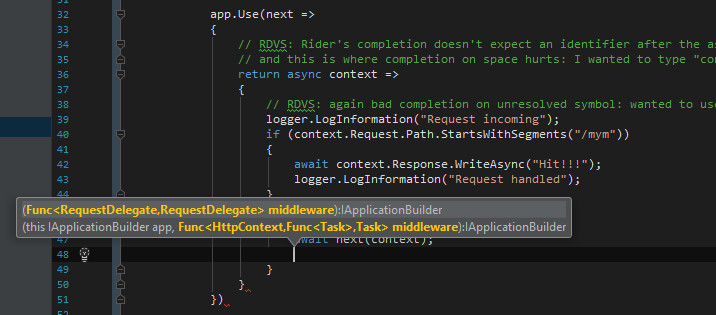

<h3>Notes, commits</h3>

<a href="https://github.com/gorohoroh/rider-visual-studio-asp.net-core-fundamentals/commit/ad558809904c44af3a7f2aa3242958896c805c30">Commit link</a>

<h2>Configuring middleware: showing exception details and configuring environment-specific middleware</h2>

<h3>Observations: Visual Studio :green_heart:</h3>

Good enough in terms of C# editing.

Launch settings are natively supported, as opposed to Rider.

<em>appsettings.Development.json</em> was automatically nested under <em>appsettings.json</em> and didn't
    require any manual configuration.

<h3>Observations: Rider :yellow_heart:</h3>

Good enough in terms of C# editing, although the "Use string interpolation" CA wasn't available when I
    needed it:

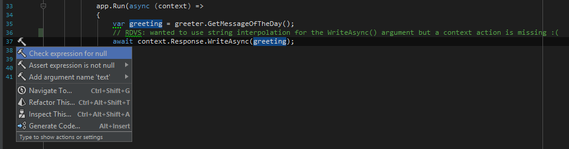

Rider doesn't pick environment or any other settings from <em>launchSettings.json</em> because it doesn't
    support launch settings: neither are they created with the ASP.NET Core template nor are they reflected
    in run configurations. Instead, environment variable settings in the default run configuration must be
    edited to switch to a different environment:  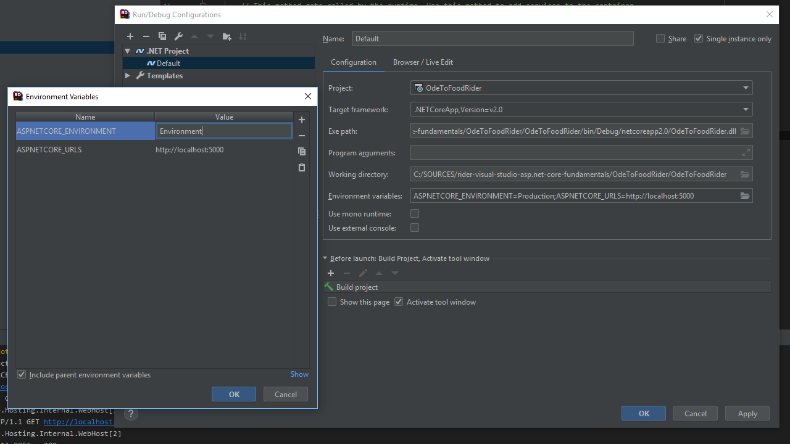

Creating <em>appsettings.Development.json</em>:

<ol>
    <li>Creating via copy-paste of <em>appsettings.json</em> works a little better than in Visual Studio
        because Rider suggest entering a name for the copy before actually creating it, and then suggests
        adding the new file to Git.
    </li>
    <li>However, Rider doesn't by default nest <em>appsettings.Development.json</em> under <em>appsettings.json</em>
        as Visual Studio does. Had to click <em>File Nesting Settings</em> in the toolbar and manually enter
        a nesting rule: <em>parent: .json, child: .Development.json</em>. 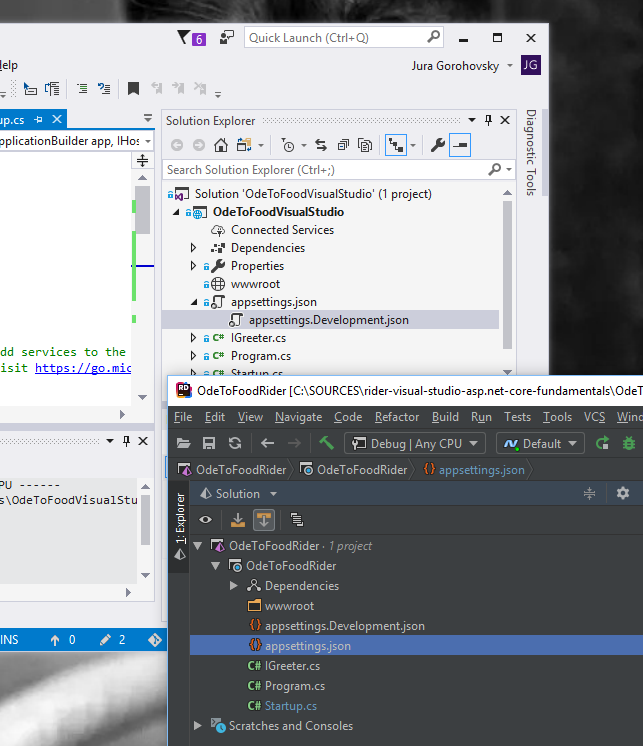
    </li>
</ol>

<h3>Notes, commits</h3>

<a href="https://github.com/gorohoroh/rider-visual-studio-asp.net-core-fundamentals/commit/032855d2ac63c7bdca103045f5da2b01cda12405">Commit
    link</a>

Neither in Visual Studio nor in Rider was I able to replicate Scott's exercise with displaying a Greeting
    value from <em>appsettings.Development.json</em> for some reason - probably a configuration mishap on my
    side.

<h2>Configuring middleware: serving static files</h2>

<h3>Observations: Visual Studio :green_heart:</h3>

All good. Involves regular C# editing + creating an HTML file.

<h3>Observations: Rider :green_heart:</h3>

All good. Involves regular C# editing + creating an HTML file.

Live template for HTML file in Rider is slightly better as it places a hotspot at the value of the <code>&lt;title&gt;</code>
    tag, and then Rider suggests adding the new file to Git.

<h3>Notes, commits</h3>

    <a href="https://github.com/gorohoroh/rider-visual-studio-asp.net-core-fundamentals/commit/94d61f8fd0dc0354b8d67350d5e3fed978edd977">Commit
        link</a>

    Along with creating an HTML file, Visual Studio removes a section that includes the <em>wwwroot</em> folder from the
    .<em>csproj</em> file. Rider doesn't do that. Unsure if this has any side effects so far.

<h2>Configuring middleware for ASP.NET MVC and adding a simple Home controller</h2>

<h3>Observations: Visual Studio :green_heart:</h3>

Viewing NuGet dependencies in Solution Explorer works fine.

Adding a directory in Visual Studio is harder: for some reason, Visual Studio's "New folder" is only available as a
    separate contextual command, and not as an item in <em>Add New Item</em> (<code>Ctrl+Shift+A</code>).

<h3>Observations: Rider :green_heart:</h3>

Viewing NuGet dependencies in Solution Explorer works fine. "Manage NuGet Packages" command is available
    in contextual menu for more nodes of the Dependencies tree than in Visual Studio, which is fine.

Adding a directory is easier in Rider as it can be done via <code>Alt+Insert</code>, along with adding
    new files.

Rider's lowerCamelCase and CamelCase completion matching is inferior to Visual Studio in simple cases
    like the below. Visual Studio suggest the expected <code>UseStaticFiles()</code> method matching <code>usf</code>;
    Rider suggests <code>UseDefaultFiles()</code> instead, both when matching with <code>usf</code> and
    <code>USF</code> (!!!!): 
    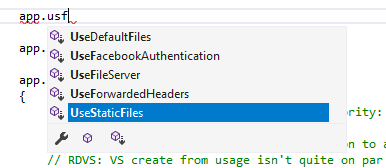
     
    vs 
    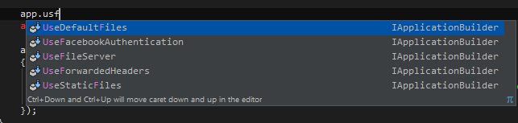

<h3>Notes, commits</h3>

    <a href="https://github.com/gorohoroh/rider-visual-studio-asp.net-core-fundamentals/commit/f6379b24491e9a60284adf7f3c242626dcc0b24a">Commit
        link</a>

<h2>Setting up conventional routing</h2>

<h3>Observations: Visual Studio :green_heart:</h3>

All fine with C# editing and adding a new controller

<h3>Observations: Rider :green_heart:</h3>

All fine with C# editing and adding a new controller

<h3>Notes, commits</h3>

<a href="https://github.com/gorohoroh/rider-visual-studio-asp.net-core-fundamentals/commit/3f4f74f725d9910d69567b156bb6226eb4adcab2">Commit link</a>

<h2>Setting up attribute routes</h2>

<h3>Observations: Visual Studio :green_heart:</h3>

C# editing around attributes works as expected.

<h3>Observations: Rider :yellow_heart:</h3>

Editing C# attributes works fine; however, import completion for the Route attribute is severely hanging: 
    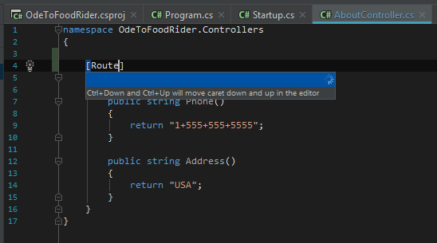

<h3>Notes, commits</h3>

<a href="https://github.com/gorohoroh/rider-visual-studio-asp.net-core-fundamentals/commit/2373c1b43b144f22205b6a02f32ca42ce8b0db34">Commit link</a>

<h2>Action results: deriving from the <code>Controller</code> base class, modifying an
    action to return <code>IActionResult</code>, creating a <code>Restaurant</code> model, instantiating and
    returning the model instance from the controller
</h2>

<h3>Observations: Visual Studio :green_heart:</h3>

All good in terms of editing C# and creating a new directory and a new model (except that creating a new
    directory is a separate action - see one of the above Visual Studio notes)

<h3>Observations: Rider :green_heart:</h3>

All good in terms of editing C# in the controller and creating a new directory for models and a new model
    in it (tried using <em>Move</em> CA and refactoring)

<h3>Notes, commits</h3>

<a href="https://github.com/gorohoroh/rider-visual-studio-asp.net-core-fundamentals/commit/f657b1f97da8ffbee2cd2dea2f3244b6c09c1117">Commit link</a>

<h2>Creating and rendering a view</h2>

<h3>Observations: Visual Studio :yellow_heart:</h3>

Visual Studio is lagging behind severely in this scenario:

<ol>
    <li>You can't create a view from usage, at all.</li>
    <li>This means if you're creating the default initial folder structure for models, you have to create a
        directory twice (separate action), and then use <em>Add New Item</em> to create a view.
    </li>
    <li>In the view, Scott right away removes the default content and uses the html template to roll out a
        barebones HTML structure (this template isn't available in Rider but it's not needed there because
        Rider's default template for a Razor view is way better and already contains an HTML skeleton.
    </li>
</ol>

When manually typing a model (<code>@model Restaurant</code>), Visual Studio doesn't suggest importing the model
    namespace - you need to manually type in an FQN.

Visual Studio doesn't provide <em>Expand/Contract Selection</em> commands in Razor views.

Visual Studio's completion only suggests the uppercase <code>@Model</code> property outside of the imports; however,
    it doesn't suggest anything when you type the lowercase <code>@model</code>, which means Rider's problem with
    suggested casing isn't as serious as it looks, because there's no typing habit for Rider completion to break when
    dealing with Visual Studio typing patterns.

<h3>Observations: Rider :green_heart:</h3>

Rider is superior in this scenario: creating a view from usage (<code>return View(model);</code>) in the
    controller:

<ol>
    <li>Creates the entire folder structure for views along with the actual view;</li>
    <li>The view is auto-typed with the model (if the model is provided) via a <code>@model</code>
        directive,
    </li>
    <li><code>@using</code> directives are automatically inserted, and a hotspot is placed at the bare
        HTML's <code>&lt;title&gt;</code> tag value.
    </li>
</ol>

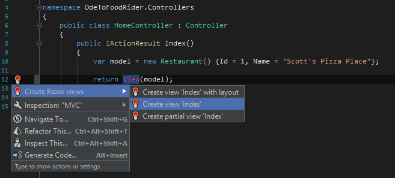

One small hiccup is that when importing the model, FQN is used both in the model and in the using
    statement whereas it's only required in the using statement.

If a Razor view is created using a file template, the resulting view is more complete as well.

When manually typing a model (<code>@model Restaurant</code>), Rider auto-imports the model namespace;
    Visual Studio doesn't do this.

Rider makes Extend/Shrink Selection available in Razor views whereas Visual Studio doesn't.

Other than that, when using the imported model in the Razor markup, it's quite annoying that completion
    suggests <code>@model</code> when model is typed, even though the lower-case <code>@model</code> is only
    applicable as the import statement, and <code>@Model</code> should be provided instead.

<h3>Notes, commits</h3>

    <a href="https://github.com/gorohoroh/rider-visual-studio-asp.net-core-fundamentals/commit/21a5fc3cdd024c69531d5805cd358d4e3b979801">Commit
        link</a>

<h2>Populating with data: creating a <em>Services</em> directory and moving
    <code>IGreeter</code> service there
</h2>

<h3>Observations: Visual Studio :yellow_heart:</h3>

Moving <em>IGreeter.cs</em> to the new <em>Services</em> directory by drag-n-drop in Solution Explorer.
    Requires updating the namespace in <code>IGreeter</code>, then compiling and going through several <em>CS0246</em>
    build errors to add a missing using directive in <em>Startup.cs</em>.

Subpar manual experience as Visual Studio doesn't have a <em>Move to Folder</em> refactoring (in fact, no
    <em>Move</em> refactorings at all, and no refactorings available on Solution Explorer nodes.)

<h3>Observations: Rider :green_heart:</h3>

Creating a new directory, again, is a bit easier. Rider modifies .csproj with a new folder include but
    Visual Studio doesn't do that: again, unclear differences in project model handling although it looks
    like Rider uses Visual Studio 2017's MSBuild distribution.

Moving <em>IGreeter.cs</em> to the new directory can be done with drag-n-drop, in which case VCS
    integration interprets the operation as a move (whereas the Visual Studio's d-n-d is seen as a file
    deletion + file addition). However, moving with drag-and-drop in Rider seems to introduce differences in
    line endings!

The better way to move <em>IGreeter.cs</em> to the new directory is certainly via Refactor This &gt; Move
    to Folder on the file node in Solution Explorer. Invoking the refactoring with default settings (that
    include fixing namespaces) just works. Good job: 
    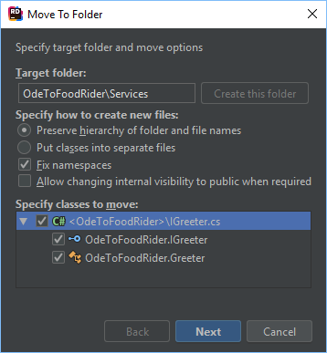

<h3>Notes, commits</h3>

    <a href="https://github.com/gorohoroh/rider-visual-studio-asp.net-core-fundamentals/commit/d80c2e6cd303271aa9cda9b6c75439f156e82014">Commit
        link</a>

<h2>Creating new services: <code>IRestaurantData</code>,
    <code>InMemoryRestaurantData</code>, registering one of them in <em>Startup.cs</em>, modifying the Home
    controller to receive restaurant data from an <code>IRestaurantData</code> service, updating the view to
    accept an enumerable model and iterate through the collection of restaurants
</h2>

<h3>Observations: Visual Studio :yellow_heart:</h3>

Visual Studio does it all fine actually; yellow here just means that Rider is significantly better during
    this coding segment.

<ol>
    <li>Creating <code>IRestaurantData</code> via <em>Ctrl+Shift+A</em>: fine.</li>
    <li>Creating the derived <code>InMemoryRestaurantData</code> class: also has to be done with <em>Ctrl+Shift+A</em>
        because there's no action to create a derived type.
    </li>
    <li>Writing code in <code>InMemoryRestaurantData</code>: all fine, with a few notes:
        <ol>
            <li>When modifying the class declaration to implement <code>IRestaurant</code>, Visual Studio
                provides <em>Implement interface</em> and <em>Implement interface explicitly</em> quick
                actions. Nice.
            </li>
            <li>Scott creates a <code>InMemoryRestaurantData()</code> constructor with the <code>ctor</code>
                code snippet - nice, but that's the only option with VS as there's no context action on a
                field to initialize the field from constructor.
            </li>
        </ol>
    </li>
    <li>Modifying the Home controller: good. Notes:
        <ol>
            <li>Visual Studio doesn't have import items in completion, which means that when referencing an
                unimported type, you have to make sure to spell and capitalize it correctly, and then use a
                quick action to add an import. In Rider, import items are available in completion, which
                allows using camelHumps and abbreviations without being precise with naming, and
                additionally, accepting an import symbol suggestion adds the necessary using statement
                without the need to explicitly invoke a quick action.
            </li>
            <li>Visual Studio provides a set of quick actions to generate <code>_restaurantData</code> (as a
                full or read-only field, full or read-only property, local variable); as well as explicit
                actions to change <code>_restaurantData</code> to <code>IRestaurantData</code> or
                <code>restaurantData</code>: 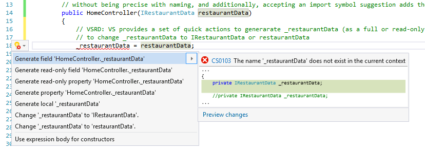
            </li>
        </ol>
    </li>
    <li>Modifying the Home view: good. Notes:
        <ol>
            <li>There's a <em>table</em> code snippet to generate an HTML table in Razor markup, nice.</li>
            <li>However, there's no <em>foreach</em> code snippet, just keyword completion.</li>
        </ol>
    </li>
</ol>

<h3>Observations: Rider :green_heart:</h3>
<ol>
    <li>Creating <code>IRestaurantData</code> via <em>Alt+Ins</em>: good, and again, Rider suggests to add
        the new file to Git right away.
    </li>
    <li>Declaring an interface member: <em>Complete Statement</em> at <code>GetAll{caret}</code> generates
        both the parentheses and the semicolon, Visual Studio doesn't do this.
    </li>
    <li>Creating <code>InMemoryRestaurantData</code> class: can be done with <em>Alt+Ins</em> but can also
        be done easier with a context action on <code>IRestaurantData</code> declaration to create a derived
        type: 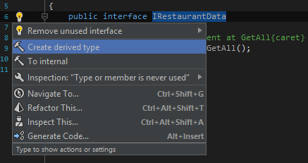 
        Then, there's a quick-fix to implement the interface, and a context action to move to a separate file.
    </li>
    <li>Writing code in <code>InMemoryRestaurantData</code>: good. Notes:
        <ol>
            <li>Quick-fix <em>Initialize field from constructor</em> is available after declaring the
                <code>_restaurants</code> field: 
                 However,
                the created constructor takes a list of restaurants as a parameter; what we need instead is
                a parameterless constructor with a field inside that is initialized with a new list. No
                context action or refactoring to convert parameter to field initialization, and the <em>Change
                    Signature</em> refactoring doesn't do that, too. No big deal to do this by hand though.
            </li>
            <li>Rider's code completion after the <code>new</code> keyword in collection initializer
                results in <code>new Restaurant()</code>, but the parentheses become redundant once braces
                are added for initializing properties. A typing assistant that removes redundant parentheses
                wouldn't hurt here.
            </li>
        </ol>
    </li>
    <li>Modifying the Home controller: great! Notes:
        <ol>
            <li>This time, after declaring a field and calling the <em>Initialize field from
                constructor</em> quick-fix, it does exactly what we want: declares a constructor with a
                <code>IRestaurantData</code> parameter. Nice!
            </li>
            <li>After modifying the parameter returned in <code>View()</code> to a collection of
                restaurants, Rider shows an error and suggests to modify the type of the view. Super
                nice! 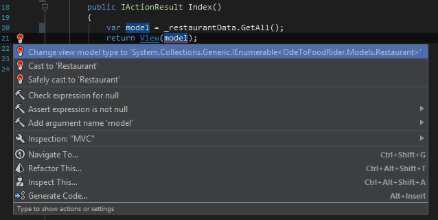
            </li>
        </ol>
    </li>
    <li>Modifying the Home view. Works, however:
        <ol>
            <li>No live template for an HTML table in Razor views. As a side note, there is one in HTML
                files handled by WebStorm, but it only generates a <code>&lt;table&gt;</code> tag pair, with
                no rows or cells inside - Visual Studio does better here.
            </li>
            <li>No <code>foreach</code> live template in Razor, only keyword completion - same as in Visual
                Studio. Also, no way to surround markup with braces.
            </li>
        </ol>
    </li>
</ol>

<h3>Notes, commits</h3>

    <a href="https://github.com/gorohoroh/rider-visual-studio-asp.net-core-fundamentals/commit/47fe289c741a5e54340cdec78fdbc9918f7bdcdc">Commit
        link</a>

<h2>Creating and using a view model for the Index view</h2>

<h3>Observations: Visual Studio :yellow_heart:</h3>

Again, Visual Studio does a good job, it's just Rider that does it better.

<ol>
    <li>Creating a directory and a file for the first view model: all fine.</li>
    <li>Modifying the controller: fine. <em>Initialize field from constructor</em> would be handy but it's not there. As
        a side note, Visual Studio now provides a quick action to use object initializer - the action is available from
        the constructor call only though, not from variable usages: 
        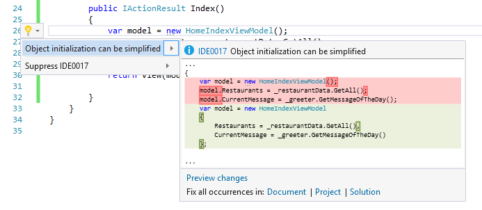
    </li>
    <li>Modifying the view: decent. Had to change model type by hand, after which it took Visual Studio ~30 seconds to
        re-resolve the <code>Model</code> in <code>foreach</code>, figure out it's now a <code>HomeIndexViewModel</code>
        and finally start suggesting view model properties in code completion.
    </li>
</ol>

<h3>Observations: Rider :green_heart:</h3>
<ol>
    <li>Creating a directory and file for view model: good (both can be created from <em>Alt+Ins</em>, Git
        add suggestion.) Again, import items in completion rock!
    </li>
    <li>Modifying the controller: great. Initialize field from constructor rocks after declaring the
        <code>_greeter</code>
        field! <em>Use object initializer</em> is available both on constructor call and on further variable
        usages. The <em>Change view model type</em> quick-fix rocks again!
    </li>
    <li>Modifying the view: considerably better than Visual Studio (because the model type has already been
        changed for us, and because <code>Model</code> is resolved quicker, with valid completion
        suggestions available instantly.
    </li>
</ol>

<h3>Notes, commits</h3>

    <a href="https://github.com/gorohoroh/rider-visual-studio-asp.net-core-fundamentals/commit/fde46ac4973fc1a76ba70bcc3b2f6b1b0c3922c4">Commit
        link</a>

<h2>Creating a new Home controller action <code>Details(int id)</code>, updating services
    with a new <code>Get(int id)</code> method to return details for a particular restaurant, creating a simple
    <em>Details</em> view, updating the <em>Index</em> view to use tag helpers and creating a required <em>_ViewImports.cshtml</em>
    along the way.
</h2>

<h3>Observations: Visual Studio :yellow_heart:</h3>

Visual Studio does the job but overall in a lot less intelligent way than Rider.

<ol>
    <li>Creating a <code>Details(int id)</code> action in the Home controller: decent.
        <ol>
            <li>Some code completion issues in Visual Studio when using a new method <code>Get(id)</code>
                before declaring it; creating the method in the interface from usage works (doesn't insert
                an implementation stub in the derived <code>InMemoryRestaurantData</code> though).
            </li>
            <li>Returning <code>RedirectToAction("Index")</code> works but Visual Studio doesn't provide
                code completion for actions in the string literal, and Scott prefers to use <code>nameof(Index)</code>
                instead; when returning a <code>View(model)</code>.
            </li>
            <li>Visual Studio doesn't see that the view doesn't exist and doesn't suggest to create one.
            </li>
        </ol>
    </li>
    <li>Updating services with a new <code>Get(int id)</code> method: fine. When going to the derived <code>InMemoryRestaurantData</code>,
        Visual Studio does provide a quick action to implement the new interface method.
    </li>
    <li>Creating the <em>Details</em> view: OK. No completion for controller and action names in tag helpers
        though.
    </li>
    <li>Creating <em>_ViewImports.cshtml</em>: OK, using a specialized item via <em>Ctrl+Shift+A</em>.
        However, Visual Studio provides no completion for the assembly name refrenced from <em>_ViewImports.cshtml</em>.
    </li>
    <li>Modifying the <em>Index</em> view to render links to restaurant details using 3 different kinds of
        syntax: <code>&lt;a href&gt;</code>, <code>@Html.ActionLink</code> and a tag helper. Visual Studio
        provides completion for tag helper attributes but, again, there's no code completion for controller
        and view names in string literals - only for C# symbols after <code>@</code>.
    </li>
</ol>

<h3>Observations: Rider :yellow_heart:</h3>

Mixed result: Rider shines with a few great features in this segment but there's a bunch of bugs as
    well.

<ol>
    <li>Creating a <code>Details(int id)</code> action in the Home controller: OK.
        <ol>
            <li>Similar code completion issues in Rider. Creating a method from usage works and also doesn't insert an
                implementation stub in the derived class; however, provides a placeholder to change the default return
                type from <code>object</code> to something else (<code>Restaurant</code>) in our case.
            </li>
            <li>A null check on model is easier to introduce with the <em>Check variable for null</em>
                context action that is conveniently available at the end of the statement; a quick path to
                null check pattern settings is provided, too - nice! 
                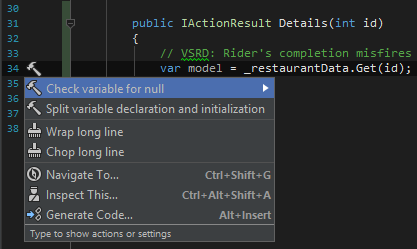
            </li>
            <li>When returning <code>RedirectToAction("Index")</code>, Rider provides code completion for actions in
                the string literal that is passed over as parameter as well as navigation to action, nice! 
                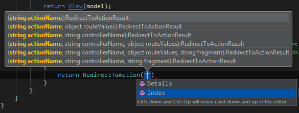 
                Using <code>nameof(Index)</code> is a bit problematic due to a ReSharper bug (RSRP-469876) but if it's
                just typed in without completion, Rider actually continues to provide navigation to the view! 
                
            </li>
            <li>When returning a View(model), Rider detects that the referenced view is missing and suggests to create
                it: 
                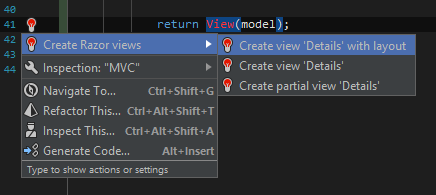
            </li>
        </ol>
    </li>
    <li>Updating services with a new <code>Get(int id)</code> method: fine. There actually is a (poorly discoverable)
        context action to implement the new interface method in derived classes: 
        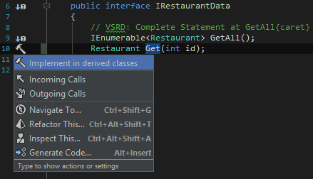 
        Good to know it's here but I'd expect a quick-fix instead. All in all, fine editing in both services.
    </li>
    <li>
        Creating the <em>Details</em> view: good, with a few quirks!
        <ol>
            <li>
                Created with a quick-fix from controller (see above) - nice!
            </li>
            <li>
                However, model completion suggests an unqualified <code>Restaurant</code> type, which then triggers an
                import action, and all that ends up with FQNs in both <code>@using</code> and <code>@model</code>
                directives - which, in turn, requires removing FQN from the <code>@model</code> directive with a
                quick-fix. Also, the file template's active hotspot in the <code>&lt;title&gt;</code> tag prevents from
                calling <em>Alt+Enter</em> on the <em>@model</em> directive - you need to fill the hotspot first of all.
            </li>
            <li><code>ModelExpressionProvider</code> annoys as the first completion suggestion for both
                <code>@mod</code> and <code>@Mod</code> - should be <code>@Model</code> instead!
            </li>
            <li>Trying to write a tag helper but there's no completion for asp-* attributes and their values. This is
                because there's no <em>_ViewImports.cshtml</em>, and Rider doesn't provide a quick-fix to create one!
            </li>
            <li>However, after creating <em>_ViewImports.cshtml</em> (see next step), Rider starts to provide completion
                for both tag helper attributes (<code>asp-action</code> and such) and their values, nice! 
                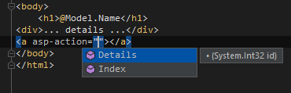
            </li>
        </ol>
    </li>
    <li>Creating <em>_ViewImports.cshtml</em>: with hiccups as there's no cshtml items in <em>Alt+Ins</em> on the <em>Views</em>
        folder (only on nested folders). Workaround: use a generic File file template. After creating <em>_ViewImports.cshtml</em>,
        there are no completion suggestions for assembly name in Rider, just like in Visual Studio :( - completion for
        the <code>@addTagHelper</code> directive is available though.
    </li>
    <li>Modifying the <em>Index</em> view to render links to restaurant details using 3 different kinds of syntax: fine,
        with a few hiccups:
        <ol>
            <li>When entering the regular anchor with relative paths, Rider complains it doesn't recognize the relative
                path, suggests to set path mapping, then nothing happens but the inspection is gone. Trying to edit path
                mappings fails silently: 
                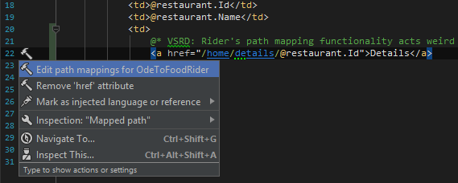
            </li>
            <li>Action link syntax: again, action resolve in string parameter; however, completion can be
                improved: 
                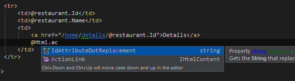
            </li>
            <li>Tag helper syntax: good! Rider even suggests asp-route-id that is derived from the Details action
                signature - something that Visual Studio doesn't do: 
                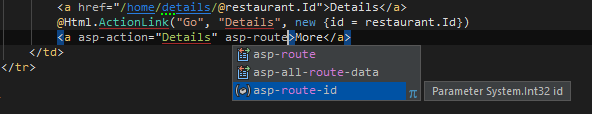
            </li>
        </ol>
    </li>
</ol>

<h3>Notes, commits</h3>

    <a href="https://github.com/gorohoroh/rider-visual-studio-asp.net-core-fundamentals/commit/ddc5a0ebabab97464050d15219bfe3c4ea143615">Commit
        link</a>

<h2>Adding a form to create restaurants</h2>

<h3>Observations: Visual Studio :yellow_heart:</h3>

Visual Studio does the job but Rider provides a lot more automation in this scenario.

<ol>
    <li>Link from <em>Index.cshtml</em> to a new <code>Create()</code> action: Visual Studio doesn't detect
        that there's no action yet. Have to create by hand in the next step.
    </li>
    <li>Creating a new <code>Create()</code> action in the Home controller. When returning
        <code>View()</code>, Visual Studio doesn't see there's no view yet.
    </li>
    <li>Creating a new <code>CuisineType</code> enum in Models: adding a new class, then changing it to
        <code>enum</code> and populating. OK.
    </li>
    <li>Adding a <code>CuisineType</code> property to the <code>Restaurant</code> model with the
        <em>prop</em> snippet: OK.
    </li>
    <li>Creating a <em>Create.cshtml</em> view manually. Notes:
        <ol>
            <li>There are no import suggestions for non-FQN types when declaring a model, have to type in
                the FQN by hand, although code completion does help with FQN
            </li>
            <li>Snippets are available for <em>form</em>, <em>select</em>, and <em>input</em>, nice!</li>
            <li>Completion of model properties in tag helpers such as <em>asp-for</em>, <em>asp-items</em> -
                nice! 
                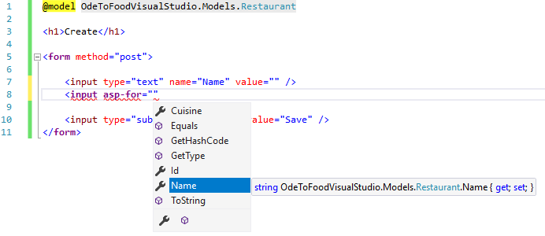
            </li>
            <li>When referencing the <code>CuisineType</code> enum, Visual Studio doesn't provide an import
                suggestion, have to go up and type a <code>@using</code> by hand.
            </li>
        </ol>
    </li>
</ol>

<h3>Observations: Rider :green_heart:</h3>

Even though there are code analysis and code completion bugs when editing a view, the overall experience
    in this scenario is much richer than in Visual Studio.

<ol>
    <li>Link from <em>Index.cshtml</em> to a new action: great! Rider sees that there's no
        <code>Create()</code> action yet, and provides a quick-fix to create one: 
        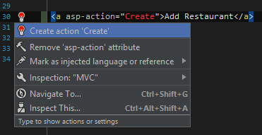
    </li>
    <li>New <code>Create()</code> action in Home Controller auto-created with the quick-fix. Now, adding a
        reference to a view that doesn't exist yet - Rider detects this, suggests to create one, and it's
        there now (and added to Git). Great!
    </li>
    <li>Creating a new <code>CuisineType</code> enum in Models: can use the <em>enum</em> file template right away.
    </li>
    <li>
        Adding a <code>CuisineType</code> property to the <code>Restaurant</code> model: OK.
    </li>
    <li>Writing code in the <em>Create.cshtml</em> view (that was auto-created for us at step 2 above):
        <ol>
            <li>No issue with model import as we referenced the model when the view was created, via a hotspot.</li>
            <li>No snippets for <em>form</em>, <em>select</em>, <em>input</em> are available.</li>
            <li>Completion list for the <em>asp-for</em> attribute can be improved: 
                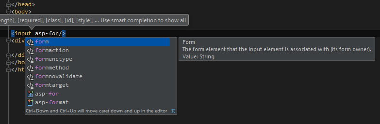 
                However, completion for model fields in <em>asp-for</em> value is available!
            </li>
            <li>Completion for <code>CuisineType</code> is available: 
                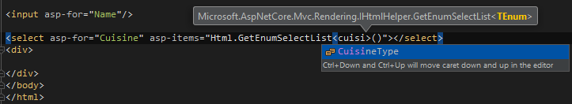 
                However! When using the <code>@</code>
                prefix ahead of the expression in the asp-items value (which compiles fine), Rider shows a bogus <em>Cannot
                    choose method from method group</em> error and fails to resolve the type parameter. When the
                <code>@</code> prefix is not used, Rider doesn't complain, and the application still compiles and runs
                (RSRP-469518)
            </li>
            <li>Completion for <em>input</em> types is available: 
                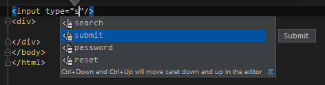
            </li>
        </ol>
    </li>
</ol>

<h3>Notes, commits</h3>

Commit links:

<ul>
    <li><a href="https://github.com/gorohoroh/rider-visual-studio-asp.net-core-fundamentals/commit/317f2e8633e4c4936cbed1ca0bc4f871c9ea3142">One</a></li>
    <li><a href="https://github.com/gorohoroh/rider-visual-studio-asp.net-core-fundamentals/commit/e1eef7de9df1b945a2555184e845b74e101f62b3">Two</a></li>
</ul>

<h2>Accepting form input: adding a restaurant edit model, modifying services,
    the Details view, and creating a new Home controller action
</h2>

<h3>Observations: Visual Studio :green_heart:</h3>

Visual Studio does the job with less automation but Rider's bugs set back its functional advantages.
    Tie in this scenario.

<ol>
    <li>Creating a <code>Create()</code> action overload in the <em>Home</em> controller to convert input
        data into a new restaurant item.
    </li>
    <li>Creating a <code>RestaurantEditModel</code> input model in <em>ViewModels</em> via <em>Add New
        Item</em> - although this in fact could be created from usage in the <em>Home</em> controller, in
        which case the file would have been created in the <em>Controllers</em> folder and then should have
        been moved to <em>ViewModels</em> (and we know Visual Studio can't modify namespaces on
        drag-and-drop).
    </li>
    <li>Modifying the new <code>Create()</code> action in the <em>Home</em> controller to receive
        a <code>RestaurantEditModel</code>, all good.
    </li>
    <li>Adding route constraints (attributes) to the two <code>Create()</code> actions.</li>
    <li>Processing input model in the input <code>Create()</code> action. Using an <code>Add()</code> method
        from <code>IRestaurantData</code> that is not declared yet, and generating it from usage.
    </li>
    <li>Implementing the <code>Add()</code> method in <code>InMemoryRestaurantData</code>: <em>Go to
        Implementation</em> from <code>IRestaurantData</code> interface declaration (because there's no <em>Go
        to Implementation</em> on specific members), and using the <em>Implement interface</em> quick action
        to create a stub. Writing implementation code.
    </li>
    <li>Modifying the <em>Details.cshtml</em> view to show more data on the restaurant entry that we've just
        created.
    </li>
</ol>

<h3>Observations: Rider :green_heart:</h3>

Rider's workflow is better automated but there are annoyances along the way. They were reported earlier,
    so let's say this is a tie with Visual Studio.

<ol>
    <li>
        Creating a <code>Create()</code> action overload in the <em>Home</em> controller: OK. Creating <code>RestaurantEditModel</code>
        from usage. Created in the <em>Home</em> controller, then moved to a separate file with a context action (still
        under <em>Controllers</em> though), then <em>Refactor This &gt; Move to Folder</em> to move the new file to <em>ViewModels</em>.
        Quite a complicated chain of actions but works, and <em>Move to Folder</em> does auto-adjust the namespace by
        default.
    </li>
    <li>Creating properties in <code>RestaurantEditModel</code> - good.</li>
    <li>Using <em>Implement in derived classes</em> CA in <code>IRestaurantData</code> to create an implementation stub
        in <code>InMemoryRestaurantData</code> and navigate there - great! Writing implementation logic - good.
    </li>
    <li>Adding route constraint attributes to the two <code>Create()</code> actions: hanging completion strikes again.
    </li>
    <li>Can navigate from the <em>Home</em> controller to <em>Details.cshtml</em> to modify the view. Modifying the
        view: OK, although, again, completion for <code>@Model</code> is annoying.
    </li>
</ol>

<h3>Notes, commits</h3>

<a href="https://github.com/gorohoroh/rider-visual-studio-asp.net-core-fundamentals/commit/e005da1a5e37f28a268f9af8f29d210425e0659e">Commit link</a>

<h2>Adding a redirect to action to prevent duplicate POST requests</h2>

<h3>Observations: Visual Studio :green_heart:</h3>

Just a one-line change to the return of the POST-specific <code>Create()</code> action: OK. Used <code>nameof</code>
    for better completion because Visual Studio doesn't suggest view names in string literals.

<h3>Observations: Rider :yellow_heart:</h3>

Just a one-line change to the return of the POST-specific <code>Create()</code> action: OK. Used string
    literal for view name instead of the <code>nameof</code> approach in Visual Studio because of the
    <code>nameof</code> completion bug referenced somewhere above.

<h3>Notes, commits</h3>

    <a href="https://github.com/gorohoroh/rider-visual-studio-asp.net-core-fundamentals/commit/a2dc13847aeb685301f6be6f0f1a275c13c88074">Commit
        link</a>

<h2>Adding model validation with data annotations in models, checking for valid
    model state in controller, and adding validation tag helpers in view
</h2>

<h3>Observations: Visual Studio :green_heart:</h3>

Visual Studio is less feature-rich but more stable. Tie again.

<ol>
    <li>Updating <em>Create.cshtml </em>to add labels to form items.<em> </em>Wrapping tags with a
        <em>div</em>: <em>Shift+Alt+W</em> in Visual Studio. However the action is not reformatting the
        resulting markup, and as <em>Extend Selection</em> doesn't work in Razor, I have to select manually,
        then invoke <em>Ctrl+K,F</em> to reformat selection.
    </li>
    <li>Updating the <code>Restaurant</code> model and the <code>RestaurantEditModel</code> view model with
        data annotations, using a quick action to import <code>System.ComponentModel.DataAnnotations</code>.
    </li>
    <li>Modifying the POST-specific <code>Create()</code> action to check if the model being passed is
        valid. Scott wraps a code selection with an <code>if/else</code> manually, although there are code
        snippets in Visual Studio.
    </li>
    <li>Updating <em>Create.cshtml</em> with placeholders for possible error messages using validation tag
        helpers.
    </li>
    <li>Adding the <code>ValidateAntiForgeryToken</code> attribute to the POST-specific
        <code>Create()</code> action.
    </li>
</ol>

<h3>Observations: Rider :green_heart:</h3>

Rider is better in terms of features, but the attribute completion tag is starting to annoy the hell out
    of me, thus a tie. Fix this, and Rider's going to be seriously better in this segment.

<ol>
    <li>Updating <em>Create.cshtml </em>to add labels to form items and placeholders for validation messages. Good.
        Completion for tag helpers and values works well; <em>Surround with template</em> lets me group label, input and
        span in a <em>div</em>. No auto-formatting on wrap but since Rider's <em>Extend Selection</em> works in Razor
        views, I can use that and then invoke <em>Reformat Code</em> on the selection.
    </li>
    <li>Updating the <code>Restaurant</code> model and the <code>RestaurantEditModel</code> view model with data
        annotations. Hanging attribute completion strikes again in both classes! (RIDER-16880), apart from this all
        fine. Context actions to move attributes between sections are nice! 
        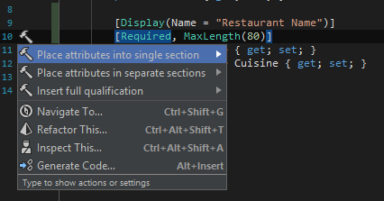
    </li>
    <li>Modifying the POST-specific <code>Create()</code> action to check if the model being passed is valid. All good.
        <em>Extend Selection</em> to the entire method body, then wrapping with an if statement using <em>Surround
            With</em>. After that, either use an <em>else</em> template to return a view if model state is invalid (in
        which case the <code>else</code> block will be highlighted as redundant), or use a quick-fix on the <em>Return
            statement is missing</em> inspection to add a return: 
        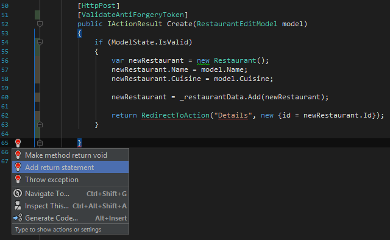
    </li>
    <li>Adding the <code>ValidateAntiForgeryToken</code> attribute to the POST-specific
        <code>Create()</code> action: all fine.
    </li>
</ol>

<h3>Notes, commits</h3>

    <a href="https://github.com/gorohoroh/rider-visual-studio-asp.net-core-fundamentals/commit/41e4d77d784aaed89116db1458c3c26887d49fdd">Commit
        link</a>

<h2>Setting up a SQL Server LocalDB connection</h2>

<h3>Observations: Visual Studio :green_heart:</h3>
<ol>
    <li>The <em>SQL Server Object Explorer</em> view in Visual Studio shows available LocalDB instances: 
        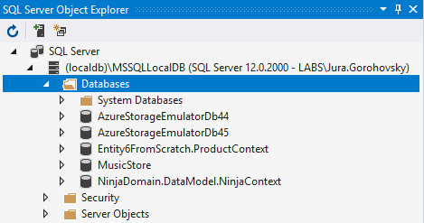
    </li>
    <li>Although this is quite clumsy, you can get a connection string by opening properties of an instance: 
        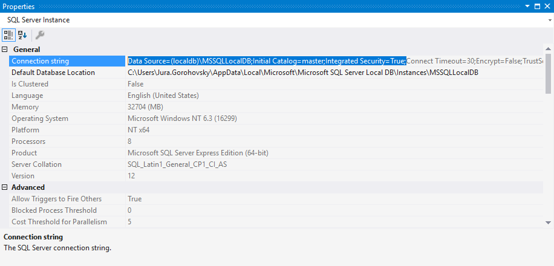
    </li>
</ol>

<h3>Observations: Rider :heart:</h3>
<ol>
    <li>Go to <em>Database &gt; Add Data source &gt; SQL Server</em>.</li>
    <li>Try to set up a connection to SQL Server Local DB, give up, drop using Rider (DBE-6705).</li>
</ol>

<h2>Installing and configuring EF Core</h2>

<h3>Observations: Visual Studio :green_heart:</h3>

(EF Core already installed as part of Microsoft.AspNetCore.All.)

<ol>
    <li>Searching for installed packages in <em>Solution Explorer &gt; project &gt; Dependencies</em>: OK
    </li>
    <li>Installing new packages via <em>Dependencies &gt; Manage NuGet Packages</em>: OK.</li>
    <li>Editing <em>.csproj</em> to install <em>Microsoft.EntityFrameworkCore.Tools.DotNet</em> as a <code>DotNetCliToolReference</code>:
        OK, although tag name completion is very basic (no camelHumps support).
    </li>
    <li>Executing <code>dotnet ef</code> commands: via system shell or via bundled <em>Package Manager
        Console</em>.
    </li>
</ol>

<h3>Observations: Rider :green_heart:</h3>

(EF Core already installed as part of Microsoft.AspNetCore.All.)

<ol>
    <li>Searching for installed packages in <em>Solution Explorer &gt; project &gt; Dependencies</em>: OK
    </li>
    <li>Installing new packages via <em>Dependencies &gt; Manage NuGet Packages</em>: OK.</li>
    <li>Editing <em>.csproj</em> to install <em>Microsoft.EntityFrameworkCore.Tools.DotNet</em> as a <code>DotNetCliToolReference</code>:
        OK. Tag name completion is better (has camelHumps support). Highlighting for empty body of an XML
        tag is annoying (funnily, it goes away on introducing a line break): 
        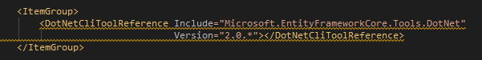
    </li>
    <li>Executing <code>dotnet ef</code> commands: via system shell or via bundled <em>Terminal</em> window.
    </li>
</ol>

<h3>Notes, commits</h3>

<a href="https://github.com/gorohoroh/rider-visual-studio-asp.net-core-fundamentals/commit/6601b7d940bc70d60f3f0bbf99922d2966274779">Commit link</a>

<h2>Creating an EF Core <code>DbContext</code> and a service implementation
    that works with the context
</h2>

<h3>Observations: Visual Studio :green_heart:</h3>

Visual Studio does the job despite different commands to create items, no import completion.

<ol>
    <li>Creating a new <em>Data</em> directory and an <code>OdeToFoodDbContext</code> class in it. Again,
        two different commands to create a directory and a class. Again, since there are no import items in
        completion, you have to be careful to type in <code>DbContext</code> exactly and properly cased
        before Visual Studio suggests to add an import statement with a quick action.
    </li>
    <li>Creating a new <code>SqlRestaurantData</code> service to use instead of
        <code>InMemoryRestaurantData</code>. New class is created via <em>Ctrl+Shift+A</em> as there's no
        action to create a new derived class form an existing interface.
    </li>
    <li>Implementing <code>SqlRestaurantData</code>. The <em>Implement Members</em> action generates stubs,
        then it's regular code editing inside the stubs + creating a constructor with <em>ctor</em>, and a
        field to store the context with another quick action. All good.
    </li>
</ol>

<h3>Observations: Rider :yellow_heart:</h3>

Rider provides more automation and more convenience with its import items in completion; however, the
    Space completion behavior kind of counters the benefits.

<ol>
    <li>Creating a new <em>Data</em> directory and an <code>OdeToFoodDbContext</code> class in it. Both with
        <em>Alt+Insert</em>, Git addition suggested. Good. <code>DbContext</code> is available as an import
        item in completion, imported seamlessly. <em>ctor</em>, <em>prop</em> live templates work well.
    </li>
    <li>
        Creating a new <code>SqlRestaurantData</code> service to use instead of <code>InMemoryRestaurantData</code>.
        Better because you can navigate to <code>IRestaurantData</code> and invoke a context action <em>Create derived
        type</em>, then implement missing members, then use another context action to move to a separate file, and Rider
        suggests adding it to Git. Nice.
    </li>
    <li>Implementing <code>SqlRestaurantData</code>. When adding a constructor and adding a parameter to it, you can
        <em>Alt+Enter</em> on the parameter to generate a read-only field, which is fine; but another approach would be
        to start typing an undeclared field to create from usage later, and this is where Rider's stupid space
        completion ruins the act: pressing <em>Space</em> at this point will complete the irrelevant library type
        instead of allowing me to type in a yet-to-be-declared field: 
        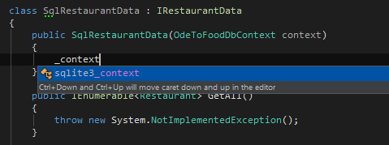 
        There's also a problem with <em>Complete Statement</em>
        with lambdas that I ran into (RSRP-470502) but it's unlikely to be a big deal for anyone unless they're using
        <em>Complete Statement</em> all the time. Otherwise C# editing is just fine.
    </li>
</ol>

<h3>Notes, commits</h3>

<a href="https://github.com/gorohoroh/rider-visual-studio-asp.net-core-fundamentals/commit/39e74507229be3014d7d388a78663c222e204061">Commit link</a>

<h2>Configuring EF Core services</h2>

<h3>Observations: Visual Studio :green_heart:</h3>
<ol>
    <li>Modifying <em>appsettings.json</em> to have a valid connection string (Visual Studio-specific DB):
        OK.
    </li>
    <li>Modifying <em>Startup.cs</em> to update available services and get access to connection string in
        <em>appsettings.json</em>. Fine. (Importing the unimported is a bit annoying, though, again.)
    </li>
</ol>

<h3>Observations: Rider :green_heart:</h3>
<ol>
    <li>Modifying <em>appsettings.json</em> to have a valid connection string (Rider-specific DB): OKю</li>
    <li>Modifying <em>Startup.cs</em> to update available services and get access to connection string: very much OK.
        Import completion items help; creating a constructor with <em>Alt+Ins</em>, adding a parameter + a quick-fix to
        create a field works, unless I want to start with using an undeclared field (then I'd be hit by a Space
        completion problem - see above.)
    </li>
</ol>

<h3>Notes, commits</h3>

Commit links:

<ul>
    <li><a href="https://github.com/gorohoroh/rider-visual-studio-asp.net-core-fundamentals/commit/16eb1abca11c39499e162f6009e7262e71c6ae52">One</a></li>
    <li><a href="https://github.com/gorohoroh/rider-visual-studio-asp.net-core-fundamentals/commit/fd5b304e41feb597419fa3de8294adf7200b5b9f">Two</a></li>
</ul>

<h2>Executing EF Core migrations</h2>

<h3>Observations: Visual Studio :green_heart:</h3>
<ol>
    <li>Executing <code>dotnet ef migrations add InitialCreate</code> via Windows Command Prompt: OK.</li>
    <li>Executing <code>dotnet ef database update</code> via Windows Command Prompt: OK.</li>
    <li>Checking that the database has been created via <em>SQL Server Object Explorer</em> in Visual
        Studio: OK.
    </li>
</ol>

<h3>Observations: Rider :heart:</h3>
<ol>
    <li>Executing <code>dotnet ef migrations add InitialCreate</code> via the <em>Terminal</em> window: OK.
    </li>
    <li>Executing <code>dotnet ef database update</code> via the <em>Terminal</em> window: OK.</li>
    <li>Checking that the database has been created via the <em>Database</em> window. Spent an hour trying
        to figure out why I don't see the right databases in the instance I'm connected to, then
        accidentally clicked the DB filter (:facepalm:): 
        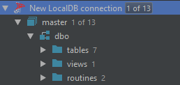
    </li>
</ol>

<h3>Notes, commits</h3>

<a href="https://github.com/gorohoroh/rider-visual-studio-asp.net-core-fundamentals/commit/287e6525b2560056b1df747185f263831dda0e08">Commit link</a>

<h2>Adding entries to the <em>Restaurants</em> table from the application and from IDE DB UI</h2>

<h3>Observations: Visual Studio :green_heart:</h3>
<ol>
    <li><em>SQL Server Object Explorer</em> &gt; DB &gt; table &gt; right-click &gt; <em>View Data</em> -
        edit data in the editor, launch the application, see the data. Changes are committed to the DB
        on-the-fly. Intuitive Excel-like editor UI: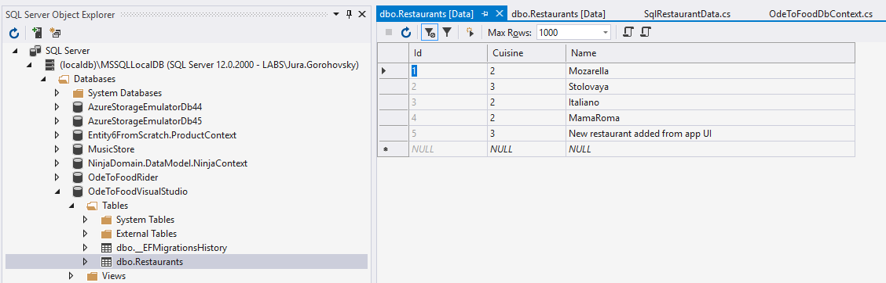
    </li>
    <li>Adding a new restaurant from application UI &gt; refreshing DB editor in Visual Studio &gt; new data is shown.
    </li>
</ol>

<h3>Observations: Rider :yellow_heart:</h3>
<ol>
    <li><em>Database</em> view &gt; find DB &gt; table &gt; F4 to edit. OK if localDB is active; cryptic
        error messages otherwise (had to refresh from Visual Studio to make the errors go away): 
        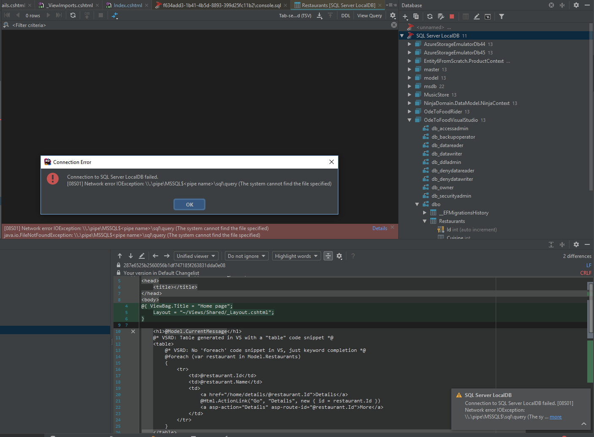 
        Editor is OK although <em>Alt+Ins</em> to add a row is less intuitive than in Visual Studio. To send
        added/modified data to database, got to click <em>Submit</em>. 
        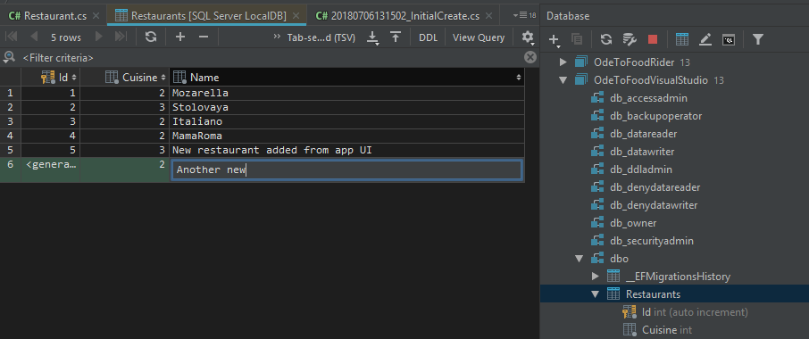
    </li>
    <li>Adding a new restaurant from application UI &gt; refreshing DB editor in Rider &gt; new data is
        shown. Fine.
    </li>
</ol>

<h2>Creating a layout view and using it from the index view</h2>

<h3>Observations: Visual Studio :green_heart:</h3>

Visual Studio does the job without notable issues.

<ol>
    <li>Creating a <em>Shared</em> folder and a layout view (<em>Add New Item</em> -&gt; Razor layout, named
        <em>_Layout.cshtml</em> by default) inside. Two different commands but OK, at least the layout item
        template is there.
    </li>
    <li>Removing redundant markup from <em>Index.cshtml. Then </em>adding a title via <code>ViewBag</code>,
        as well as a path to layout (no path completion).
    </li>
    <li>Adding a <code>@RenderSection</code> block to <em>_Layout.cshtml</em>: OK.</li>
    <li>Adding a footer section to the <em>Index</em> view: OK.</li>
</ol>

<h3>Observations: Rider :yellow_heart:</h3>

Rider does the job but there are issues in file templates and completion.

<ol>
    <li>Creating a <em>Shared</em> folder and a layout view inside. Both folder and file are created via
        <em>Alt+Ins</em>, which is fine. However, there's no file template for a Razor layout! Workaround:
        create a regular view, call it <em>_Layout.cshtml</em>, remove the <code>@model</code> directive,
        add <code>@ViewBag.Title</code> and <code>@RenderBody</code>.
    </li>
    <li>Removing redundant markup from <em>Index.cshtml.
        Then </em>adding a title via <code>ViewBag</code>, as well as a path to layout. For layout path, there's
        reference completion that suggests available views, and this looks fine; HOWEVER, if I go Scott's way and start
        entering a file path from application root, the reference completion will hinder and eat the entered path as
        soon as completion is committed: 
        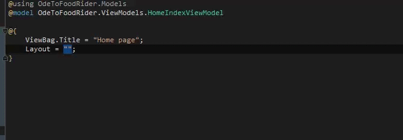
    </li>
    <li>Adding a <code>@RenderSection</code> block to <em>_Layout.cshtml</em>: OK.</li>
    <li>Adding a footer section to the <em>Index</em> view: OK.</li>
</ol>

Time and again, Rider seems to reformat <em>.csproj</em> files automatically on adding new files. Looks
    like RIDER-6450.

<h3>Notes, commits</h3>

<a href="https://github.com/gorohoroh/rider-visual-studio-asp.net-core-fundamentals/commit/622e61cef13a5c6043784abffb0bfa0d5406f3d3">Commit link</a>

<h2>Creating <em>_ViewStart.cshtml</em> and editing titles in other views</h2>

<h3>Observations: Visual Studio :green_heart:</h3>

All goes as expected in Visual Studio

<ol>
    <li>Creating <em>_ViewStart.cshtml</em> in the <em>Views</em> folder: there's a special <em>Razor View
        Start</em> file template with the correct name and default content. All fine.
    </li>
    <li>Editing <em>Create</em>, <em>Details</em> views to define titles; editing the <em>Index</em> view to
        remove a layout reference because it's now in <em>_ViewStart.cshtml</em>: OK.
    </li>
</ol>

<h3>Observations: Rider :yellow_heart:</h3>

OK in Rider but a view start file template is missing.

<ol>
    <li>Creating <em>_ViewStart.cshtml</em> in the <em>Views</em> folder: there's no Razor view start file template
        available in the folder, nor are there any Razor templates. Workaround: use the generic file template.
    </li>
    <li>Editing <em>Create</em>, <em>Details</em> views to define titles and remove redundant HTML markup
        (Rider's file templates for views contain more of it than Visual Studio's templates); editing the
        <em>Index</em> view to remove a layout reference because it's now in <em>_ViewStart.cshtml</em>: OK. 
    </li>
</ol>

<h3>Notes, commits</h3>

<a href="https://github.com/gorohoroh/rider-visual-studio-asp.net-core-fundamentals/commit/b70b41ca6345c7fd5bf4d85a896e8aa6edd4b4c7">Commit link</a>

<h2>Putting common using statements into <em>_ViewImports.cshtml</em></h2>

<h3>Observations: Visual Studio :yellow_heart:</h3>

Visual Studio does the job but requires too much manual work.

<ol>
    <li>Editing <em>_ViewImports.cshtml</em>: OK, although FQN completion is clumsy.</li>
    <li>Going through views to remove redundant using directives by hand: no quick actions to do this in
        Razor files.
    </li>
</ol>

<h3>Observations: Rider :green_heart:</h3>

Rider does a far better job, thanks to completion and batch QFs.

<ol>
    <li>Editing <em>_ViewImports.cshtml</em>: good, completion works well.</li>
    <li>Going to the first view, and batch-executing two quick-fixes: <em>Remove unused directives</em> and
        <em>Remove redundant qualifier</em>. Nice! 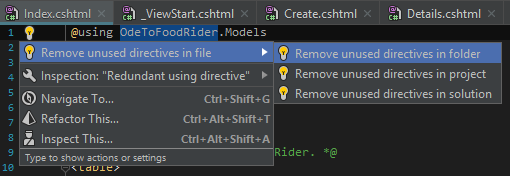
    </li>
</ol>

<h3>Notes, commits</h3>

<a href="https://github.com/gorohoroh/rider-visual-studio-asp.net-core-fundamentals/commit/043ba15a6f2c1b61d1df0ba6463720c322fabfeb">Commit link</a>

<h2>Using Razor Pages</h2>

<h3>Observations: Visual Studio :yellow_heart:</h3>

Visual Studio does the job - nothing special though. A few code completion/code analysis issues along the
    way.

<ol>
    <li>Creating a <em>Pages</em> folder, adding a page via <em>New Item &gt; Razor Pages &gt; Razor
        Page</em> (additional templates include <em>Razor Page using EF</em> and <em>Razor Page using EF
        (CRUD)</em>) called <em>Greeting.cshtml</em>. All fine.
    </li>
    <li>Editing <em>Greeting.cshtml</em>: code completion for C# references is there.</li>
    <li>Copy/pasting <em>_ViewImports</em> and <em>_ViewStart</em> to the <em>Pages</em> folder, editing
        <em>_ViewImports</em> to use more namespaces.
    </li>
    <li>Editing <em>Greeting.cshtml</em> by adding an <code>@inject</code> directive (and Scott is having
        all kinds of issues with VS showing red code because of files not saved).
    </li>
    <li>Editing <em>ViewStart</em> to use a <em>_Layout.cshtml</em> in the <em>Pages</em> folder (which is
        not there); copy-pasting existing <em>_Layout.cshtml</em> to the <em>Pages</em> folder.
    </li>
    <li>Editing <em>Greeting.cshtml</em> to use a <code>@model</code> instead of <code>@inject</code>. This
        generates a code-behind file (<em>Greeting.cshtml.cs</em>, or was it there since adding the Razor
        page?<em>) </em>and also shows a nested and seemingly
        redundant<em>_Pages_Greeting</em>: 
        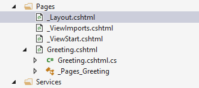
    </li>
    <li>Editing code-behind: injecting service, getting message of the day within <code>OnGet()</code>.</li>
    <li>Editing <em>Greeting.cshtml</em> to render a property on the code-behind, and adding a required
        parameter via the <code>@page</code> directive; editing code-behind to make use of the parameter
        (adding string interpolation)
    </li>
</ol>

Visual Studio has at some point modified the .sln file to change project GUID. Made a similar change in
    Rider manually.

<h3>Observations: Rider :heart:</h3>

It all goes wrong as soon as Rider fails to properly create an item for a Razor page; if this is
    resolved, then the overall experience should be solid.

<ol>
    <li>Creating a <em>Pages</em> folder: fine. Creating a Razor Page: no file template for Razor Pages;
        workaround: create a regular MVC view.
    </li>
    <li>Editing <em>Greeting.cshtml</em>: OK, though no completion after @page directive.</li>
    <li>Copy/pasting <em>_ViewImports</em> and <em>_ViewStart</em> to the <em>Pages</em> folder, editing
        <em>_ViewImports</em> to use more namespaces: OdeToFoodRider.Pages (the Razor page code-behind) is
        unresolved: 
        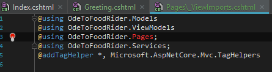
    </li>
    <li>Editing <em>Greeting.cshtml</em> by adding an <code>@inject</code> directive: good! Rider even suggests a name
        for the injected property.
    </li>
    <li>Editing <em>ViewStart</em> to use a <em>_Layout.cshtml</em> in the <em>Pages</em> folder (which is not there).
        Rider highlights the reference "_Layout.cshtml" with red but doesn't suggest to create a page. Copy-pasting by
        hand doesn't remove red highlighting: Rider doesn't seem to understand the file system-based way to reference a
        layout in this case.
    </li>
    <li>Editing <em>Greeting.cshtml</em> to use a <code>@model</code> instead of <code>@inject</code>. Model is
        unresolved (because code-behind hadn't been generated); creating from usage creates a regular class in the Pages
        directory, instead of a nested <em>Greeting.cshtml.cs</em>. Have to rename, after which it's properly nested.
        Changing namespace in the code-behind to .Pages fixes resolve from <em>ViewImports</em>. 
        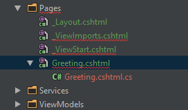
    </li>
    <li>Editing code-behind: injecting service, creating <code>OnGet()</code> and displaying message of the day: all
        fine but <code>OnGet()</code> highlighted as never used.
    </li>
    <li>Editing <em>Greeting.cshtml</em> to render a property on the code-behind, and adding a required
        parameter via the <code>@page</code> directive; editing code-behind to make use of the parameter:
        OK.
    </li>
</ol>

<h3>Notes, commits</h3>

<a href="https://github.com/gorohoroh/rider-visual-studio-asp.net-core-fundamentals/commit/e7d3fbbe9cf6699099a9923f463149a4f737ad0f">Commit link</a>

<h2>Adding the Edit form using Razor Pages</h2>

<h3>Observations: Visual Studio :green_heart:</h3>

VS gets the job done, with usual small annoyances (no import completion, shaky code analysis in Razor
    page view etc.)

<ol>
    <li>Adding a new <em>Pages/Restaurants</em> directory and <em>Edit.cshtml</em> Razor page (file template
        with code-behind).
    </li>
    <li>Adding a link to the new page from the <em>Index</em> view.</li>
    <li>Copying over a form from the <em>Create</em> view to <em>Edit.cshtml</em> and adapting (such as
        adding a hidden input for restaurant ID).
    </li>
    <li>Adding the <code>Update()</code> method to <code>IRestaurantData</code> and derived types (just a
        stub in <code>InMemoryRestaurantData</code>)
    </li>
    <li>Editing <em>Edit</em> page code-behind with a constructor accepting an <code>IRestaurantData</code>
        and saving to a field, a bind property to hold and update restaurant information, implementing
        <code>OnGet(int id)</code> and adding <code>OnPost()</code> with model validation.
    </li>
</ol>

<h3>Observations: Rider :yellow_heart:</h3>

Rider provides a few nice features but again, there's no way to easily create a Razor page with
    code-behind + there's an array of minor annoying bugs. Yellow because the Red flag for the lack of the
    file template had already been given.

<ol>
    <li>Adding a new <em>Pages/Restaurants </em>directory and <em>Edit.cshtml</em> Razor page. Again, no Razor Page file
        template, had to apply a workaround by creating a Razor view + codebehind file (which was created with a weird
        <code>ASP</code> namespace instead of the proper <code>OdeToFoodVisualStudio.Pages.Restaurants)</code>.
        After misplacing the new Razor page file, moved it to the right directory with <em>Move to Folder</em>, which
        introduced a line ending-only change in <em>.csproj</em>. Editing the Razor page triggered a flow of exceptions
        in Rangeable container, Rider protocol, typing assists etc. Unfortunately this is not easily reproducible, so
        just updated Rider to the latest nightly instead.
    </li>
    <li>Adding a link to the new page from the <em>Index</em> view: OK</li>
    <li>Copying over a form from the <em>Create</em> view to <em>Edit.cshtml</em> and adapting. Again,
        completion at <code>asp-for</code> could be better. Otherwise fine, especially nice to be able to
        use the <em>Change All</em> quick-fix to correct copy-pasted model references: 
        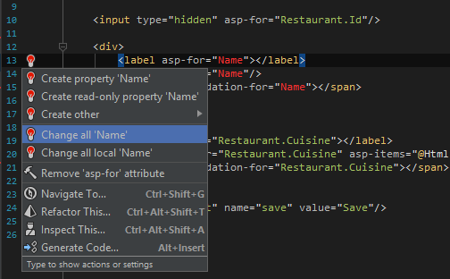
    </li>
    <li>Adding the <code>Update()</code> method to <code>IRestaurantData</code> and derived types. CA
        Implement in derived types and its type selector: nice! 
        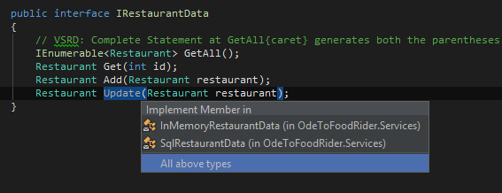 
        Shortcut completion for enum members is nice, too: 
        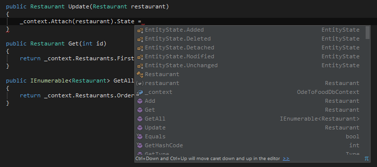 
        Overall very solid editing experience.
    </li>
    <li>Editing the <em>Edit</em> page's code-behind. Attribute completion strikes again! <em>Introduce
        readonly field</em> quick-fix from constructor is useful here, again (although every time I hesitate
        over the generated field should in fact be read-only). <code>OnGet()</code>, <code>OnPost()</code>
        are highlighted as unused. Action and controller arguments of <code>RedirectToAction()</code> are
        highlighted as regular string literals, as opposed to their special treatment in MVC
        controllers: 
         
        The <em>if</em> live template continues to be deployed into a weird <code>if(b)</code>. Otherwise fine.
    </li>
</ol>

<h3>Notes, commits</h3>

<a href="https://github.com/gorohoroh/rider-visual-studio-asp.net-core-fundamentals/commit/d721c764a7b1e77225ffbc9f230e296336dbbd00">Commit link</a>

<h2>Refactoring the <em>Index</em> view to use a new <em>_Summary</em> partial view
</h2>

<h3>Observations: Visual Studio :green_heart:</h3>

All fine in Visual Studio.

<ol>
    <li>Editing the <em>Index</em> view to use a partial view for each restaurant summary instead of a
        table.
    </li>
    <li>Creating a <em>_Summary.cshtml</em> partial view under <em>Views/Home</em> with <em>Add New
        Item</em>. Adding markup to display a restaurant summary. Copying links to <em>Details</em> and <em>Edit</em>
        views from <em>Index.cshtml</em> and adapting them.
    </li>
</ol>

<h3>Observations: Rider :green_heart:</h3>

Rider works well enough. Creating views from usage doesn't work here for whatever reason but Visual
    Studio doesn't have that, too. On par with VS although there are bugs to be reported.

<ol>
    <li>Editing the <em>Index</em> view to use a partial view for each restaurant summary. View completion in string
        literals is nice! We need to reference a view that's not created yet though. Removing the table is easier with
        <em>Extend Selection</em> (which in Visual Studio is only available in C#). Surrounding the <em>Create</em>
        action link with a <em>div</em> via <em>Surround With</em> works but does so in a weird way, using the <code>&lt;a/&gt;</code>
        tag by default, and putting a hotspot on the closing tag instead of the opening tag.
    </li>
    <li>Creating a <em>_Summary.cshtml</em> partial view, and it looks like we can do that from
        usage! 
         
        HOWEVER, it looks like no, we can't - for no particular reason: 
         
        OK, creating from live template then.
    </li>
    <li>Editing <em>_Summary.cshtml</em>. No sync-editing of HTML tags, and on a mismatch between the opening and the
        closing tag, the <em>Insert closing tag</em> quick-fix adds a new closing tag instead of replacing the
        mismatching one. Otherwise fine; using <em>Change All</em> again to replace a variable with <code>Model</code>.
    </li>
</ol>

<h3>Notes, commits</h3>

<a href="https://github.com/gorohoroh/rider-visual-studio-asp.net-core-fundamentals/commit/7c2db6646dbb28c302e0b97862b47f1e05fb0fc7">Commit link</a>

<h2>Moving the footer section to a new view component</h2>

<h3>Observations: Visual Studio :green_heart:</h3>

Visual Studio does the job at its usual standard although creating the directory hierarchy for view
    component view is particularly tricky.

<ol>
    <li>Creating a <em>ViewComponents</em> folder and a <em>GreeterViewComponent.cs</em> class inside.
        Adding a constructor and the <code>Invoke()</code> method referencing a view that doesn't exist yet.
    </li>
    <li>Removing the footer section from <em>Index.cshtml</em> as it's going to be a view component.</li>
    <li>Under <em>Views/Shared</em>, creating directory hierarchy <em>Components/Greeter</em>, and a new
        Razor view inside to be used by the view component: <em>Default.cshtml</em>. Creating these 3 items is a bit
        painful in VS. Very few edits to the view.
    </li>
    <li>Editing <em>_Layout.cshtml</em> to include 2 alternative ways of invoking the view component. One of
        them, the tag helper way, requires adding another directive to <em>_ViewImports.cshtml</em> - by
        hand.
    </li>
</ol>

<h3>Observations: Rider :yellow_heart:</h3>

Rider makes a statement to be better with the quick-fix to create view component views from usage -
    however, the quick-fix is unfortunately broken.

<ol>
    <li>Creating a <em>ViewComponents</em> folder and a <em>GreeterViewComponent.cs</em> class inside; adding logic to
        the class. All good, <em>Create readonly field from constructor parameter</em> helps again.
    </li>
    <li>Trying to create the <em>Default</em> view for the view component with a quick-fix: 
         
        It doesn't work unfortunately, throwing DEXP-361709 along the way. OK, creating manually, which is less
        cumbersome to do than in Visual Studio anyway. Adding simple view content, all fine.
    </li>
    <li>Editing <em>_Layout.cshtml</em> to invoke the view component in two ways. Completion for view component class in
        string literals is a nice surprise: 
         
        Neither Rider nor Visual Studio provide completion for the tag helper syntax. Adding a directive to
        <em>_ViewImports.cshtml</em> - OK although there's no completion for namespaces (much like Visual Studio)ю
    </li>
</ol>

<h3>Notes, commits</h3>

<a href="https://github.com/gorohoroh/rider-visual-studio-asp.net-core-fundamentals/commit/d1e4e4af7104e2591856468513a49413b9e1fd51">Commit link</a>

<h2>Switching over to using SSL</h2>

<h3>Observations: Visual Studio :green_heart:</h3>

Visual Studio makes the process easy. Automating the generation of a self-signed certificate is
    especially appreciated.

<ol>
    <li>Switching to use SSL: <em>Project properties &gt; Debug &gt; Enable SSL</em>. A new URL is
        generated, copying it to the adjacent <em>App URL</em> setting. The actual settings are stored in
        <em>launchSettings.json &gt; iisExpress</em>. When first trying to start an application that is
        configured to use SSL, Visual Studio suggests that a self-signed certificate is generated by IIS
        Express for development purposes, and then suggests to trust the certificate.
    </li>
    <li>Adding the <code>Rewriter()</code> middleware to <em>Startup.cs</em> with an option to permanently
        redirect all HTTP to HTTPS requests.
    </li>
</ol>

<h3>Observations: Rider :heart:</h3>

Poor experience. Running ASP.NET Core on IIS Express is not supported (RIDER-11638), thus
    you need to search for and go through a way to configure Kestrel to use SSL, which is not trivial. You
    also have to take care of generating a certificate with a PowerShell script on Windows or using a
    separate procedure on Mac/Unix.

<ol>
    <li>Switching to use SSL. Since Rider uses Kestrel directly, and even if it did use IIS Express as a
        proxy, it doesn't understand <em>launchsettings.json</em>, I need to set up SSL in Kestrel instead.
        Rider doesn't help at all with generating a certificate. Had to generate a certificate and configure
        Kestrel to use HTTPS and the certificate based on <a
                href="https://www.humankode.com/asp-net-core/develop-locally-with-https-self-signed-certificates-and-asp-net-core">this
            guide</a>. (<a
                href="https://docs.microsoft.com/en-us/aspnet/core/fundamentals/servers/kestrel?tabs=aspnetcore2x&amp;view=aspnetcore-2.0#endpoint-configuration">Microsoft's
            own documentation</a> is way less helpful.)
        Quite a painful and time-consuming process.
    </li>
    <li>Adding <code>Rewriter()</code> middleware - OK.</li>
</ol>

<h3>Notes, commits</h3>

Commits:

<ul>
    <li><a href="https://github.com/gorohoroh/rider-visual-studio-asp.net-core-fundamentals/commit/67fb3ecd90b9c86a787f11fe5ad64a92ef7823e7">One</a></li>
    <li><a href="https://github.com/gorohoroh/rider-visual-studio-asp.net-core-fundamentals/commit/f846341162bc4d0f067c7084959e47f942f89485">Two</a></li>
</ul>

<h2>Registering with an OpenID provider, adding OpenID configuration, configuring services and middleware, marking
    controllers, actions and page code-behind to use authorization
</h2>

<h3>Observations: Visual Studio :green_heart:</h3>

Visual Studio does the job, with some annoyances like no import items in completion (which bites in OAuth
    configuration).

<ol>
    <li>Scott creates an app registration using his Azure AD B2C user account: 
         
        I registered two OAuth apps (one for Rider and one for Visual Studio) with my GitHub account instead.
    </li>
    <li>Adding OAuth-related settings, modifying <em>Startup.cs</em> and <em>Program.cs</em> - a mix of
        Scott's actions and <a href="https://www.jerriepelser.com/blog/authenticate-oauth-aspnet-core-2/">this tutorial</a>
        that is .NET Core/GitHub-specific. All regular C# and a bit of JSON editing. Fine but again, no import items in
        completion is a pain in Visual Studio. Also, copy-pasting isn't enjoyable as each unimported symbol
        must be imported with a separate quick action. Rider/ReSharper are way better in this regard.
    </li>
    <li>Marking the <em>Home</em> controller and its actions, as well as the <u><em>Edit</em></u> page
        code-behind with <code>[Authorize]</code> and <code>[AllowAnonymous]</code> attributes.
    </li>
</ol>

<h3>Observations: Rider :green_heart:</h3>

Rider does the job albeit with its own share of annoyances (import completion in attributes!)
    Copy-pasting code in Rider is enjoyable though, thanks to import suggestion that adds all imports at
    once.

<ol>
    <li>Using two GitHub app registrations (separate for Rider and Visual Studio).</li>
    <li>Adding OAuth-related JSON settings file, modifying <em>Startup.cs</em> and <em>Program.cs</em> to
        implement GitHub-based OAuth, using the same mix of Scott's video and a .NET Core/GitHub-focused
        tutorial as in the Visual Studio part. Copy-pasting parts from Visual Studio, and the import pop-up
        rocks in that it imports everything at once!
    </li>
    <li>Marking the <em>Home</em> controller and its actions, as well as the <u><em>Edit</em></u> page
        code-behind with <code>[Authorize]</code> and <code>[AllowAnonymous]</code> attributes. Import
        completion in attributes strikes again!
    </li>
</ol>

<h3>Notes, commits</h3>

<a href="https://github.com/gorohoroh/rider-visual-studio-asp.net-core-fundamentals/commit/170462ecf4d0bfb1296acd0c782079b89aa190f5">Commit link</a>

<h2>Displaying information about user identity</h2>

<h3>Observations: Visual Studio :green_heart:</h3>

Adding markup and code to <em>_Layout.cshtml</em> that goes through user identity information and
    displays claim values. Regular Razor editing. All fine.

<h3>Observations: Rider :green_heart:</h3>

Adding markup and code to <em>_Layout.cshtml</em> that goes through user identity information and displays claim
    values. Regular Razor editing. All good.

<h3>Notes, commits</h3>

    <a href="https://github.com/gorohoroh/rider-visual-studio-asp.net-core-fundamentals/commit/842201431ba9b26ac2be500d132afce343daf74d">Commit
        link</a>

<h2>Adding <em>package.json</em> and installing bootstrap</h2>

<h3>Observations: Visual Studio :green_heart:</h3>

Polished experience in Visual Studio. npm dependency indication in Solution Explorer is a nice bonus. The
    default content of <em>package.json</em> is a bit different from Rider.

<ol>
    <li>Adding <em>package.json</em> to the project via <em>Add new item</em> -&gt; <em>npm configuration
        file</em> template. This introduces a new <em>npm</em> node in project dependencies. (<em>node_folders</em>
        isn't shown by default though, unless <em>Show all files</em> is on.
    </li>
    <li>Adding a <em>bootstrap</em> dependency in <em>package.json</em> &gt; saving &gt; Visual Studio
        auto-installs the package. Completion in <em>package.json</em> is very solid: both for property
        names (incl. packages available in npm) and values (versions of the packages).
    </li>
</ol>

<h3>Observations: Rider :green_heart:</h3>

Very solid experience in Rider, too. No dependency indication in Solution Explorer but overall smoother
    in terms of adding and editing <em>package.json</em>. Explicitly suggesting to start installing
    dependencies is probably a safer approach, too.

<ol>
    <li>Adding <em>package.json</em> to the project via WebStorm's file template, which suggests a name
        based on project name - nice touch!
    </li>
    <li>Adding a <em>bootstrap</em> dependency. Completion in package.json is on par with Visual Studio, it
        looks like it even works faster. Rider doesn't auto-install but instead, suggests to install
        dependencies, and does that if I allow it to: 
         
        The only downside is that there's no npm node in the project's Dependencies node in Solution Explorer,
        so you can only see there are installed dependencies if you choose to <em>Show all files</em>.
    </li>
</ol>

<h3>Notes, commits</h3>

<a href="https://github.com/gorohoroh/rider-visual-studio-asp.net-core-fundamentals/commit/6072aa78ed103827fd1d2d06d61740605c43acc8">Commit link</a>

<h2>Writing an application builder extension method to enable serving files from <em>node_modules</em> (as
    an alternative to using something like gulp or grunt)
</h2>

<h3>Observations: Visual Studio :yellow_heart:</h3>

Visual Studio: decent experience with ups and downs: drag-and-drop CSS to put a link reference to it is
    nice, but having to use an external namespace to enable code completion is not.

<ol>
    <li>Adding an undeclared application builder extension method to <em>Startup.cs</em> that would enable
        serving static files. Visual Studio can't create extension methods from usage.
    </li>
    <li>Adding a <em>Middleware</em> folder and a new class in it to implement the extension method. Putting
        the class in the <code>Microsoft.AspNetCore.Builder</code> namespace to enable Visual Studio's code
        completion to see it (
    </li>
    <li>Editing <em>_Layout.cshtml</em> to refer to <em>bootstrap.css</em> in <em>node_modules</em>. Visual
        Studio can generate a link tag with the right path when you drag-and-drop <em>bootstrap.css</em>
        from Solution Explorer, quite a nice touch.
    </li>
</ol>

<h3>Observations: Rider :yellow_heart:</h3>

Rider: also up and down. Not being able to create extension methods from usage is sad. Completion issues
    in paths are annoying, too. C# editing is good though, so let's make it even.

<ol>
    <li>Adding an undeclared application builder extension method to <em>Startup.cs</em> that would enable serving
        static files. Shocking fact: Rider can't create an extension method from usage, either: 
        
    </li>
    <li>Adding a <em>Middleware</em> folder and a new class in it to implement the extension method. Smooth C# editing.
        Rider shows the extension method on call site without having to put it into an external namespace.
    </li>
    <li>
        Editing <em>_Layout.cshtml</em> to refer to <em>bootstrap.css</em> in <em>node_modules</em>. Writing a link by
        hand. Rider doesn't recognize the ~-starting path and doesn't provide no sensible completion when you write the
        path. (A similar path problem occurred earlier in the course, see above.)
    </li>
</ol>

<h3>Notes, commits</h3>

    <a href="https://github.com/gorohoroh/rider-visual-studio-asp.net-core-fundamentals/commit/1ece66e0bc1ca897d0cd7d0e161427633b580462">Commit
        link</a>

<h2>Styling views with bootstrap</h2>

<h3>Observations: Visual Studio :yellow_heart:</h3>

Adding bootstrap classes to various elements across Razor views and layouts. Visual Studio's code
    completion isn't helpful at all (suggests certain bootstrap classes but they aren't what I need every
    single time - this is probably hippie completion for class names that were already used).

<h3>Observations: Rider :yellow_heart:</h3>

Adding bootstrap classes to various elements across Razor views and layouts. Completion is unhelpful, too, and as in
    Visual Studio, it's probably hippie completion. I assume that these problems are related to the way <em>bootstrap.css</em>
    is referenced in <em>_Layout.cshtml</em>.

<h3>Notes, commits</h3>

<a href="https://github.com/gorohoroh/rider-visual-studio-asp.net-core-fundamentals/commit/0b8071413e2336482aeb8e7d8603c7397adda0d3">Commit link</a>

<h2>Adding client-side validation</h2>

<h3>Observations: Visual Studio :green_heart:</h3>

All fine in Visual Studio. Well, maybe generating script/link references with drag-and-drop is not as
    nice as I thought, as it requires quite a bit of precise mouse manipulation and adding new lines in the
    editor beforehand.

<ol>
    <li>Adding a few more dependencies into <em>package.json</em>, they're then auto-installed.</li>
    <li>Drag-and-dropping each of the installed dependencies into <em>_Layout.cshtml</em> to generate script
        references to them.
    </li>
</ol>

<h3>Observations: Rider :yellow_heart:</h3>

Rider is doing great in terms of package.json editing but disappoints when editing script references
    (path completion).

<ol>
    <li>Adding a few more dependencies into <em>package.json</em>. The <em>Update Dependencies</em> popup is late to
        show up this time but there's also a quick-fix to run npm install that is available earlier, nice! 
        
    </li>
    <li>Typing script references by hand. Tried to go up to project folder in path completion but weirdly enough, it
        doesn't see the <em>node_modules</em> directory at all: 
         
        It's a bit better when completing from root this
        time (<em>node_modules</em> can be seen on <code>~/{caret}</code>) but after the next slash, path completion
        starts to look into project root instead of showing what's inside <em>node_modules</em>: 
        
    </li>
</ol>

<h3>Notes, commits</h3>

<a href="https://github.com/gorohoroh/rider-visual-studio-asp.net-core-fundamentals/commit/7b546b8429b5c5d3bbc5543477419374f4021d84">Commit link</a>

<h2>Using CDNs in production environment</h2>

<h3>Observations: Visual Studio :green_heart:</h3>

Wrapping script and link references in <em>_Layout.cshtml</em> with the <code>&lt;environment/&gt;</code>
    tag and using various ASP.NET tag helpers to test if scripts and stylesheets have in fact been delivered
    from a CDN.

Visual Studio does a very good job providing code completion for tag helper attributes in the <code>&lt;link/&gt;</code>
    tag: 
    

Wrapping markup with tags is a bit cumbersome though.

<h3>Observations: Rider :yellow_heart:</h3>

Wrapping with tags is more fluid with surround templates but there's a bug whereby after applying the
    surround template, a hotspot is put in the closing tag (this already occurred in one of the prior
    segments).

Unfortunately, Rider provides zero completion both for the <code>&lt;environment/&gt;</code> tag, its
    attributes and values, as well as for the tag helpers that are available inside the
    <code>&lt;link/&gt;</code> and <code>&lt;script/&gt;</code> tags (<code>asp-fallback-test-class</code>
    etc.).

This is missing functionality but let's go with yellow instead of red as this isn't a very mainstream
    scenario.

<h3>Notes, commits</h3>

<a href="https://github.com/gorohoroh/rider-visual-studio-asp.net-core-fundamentals/commit/b1cc9ec815717ec2d110822921107c4d83a57cb2">Commit link</a>

